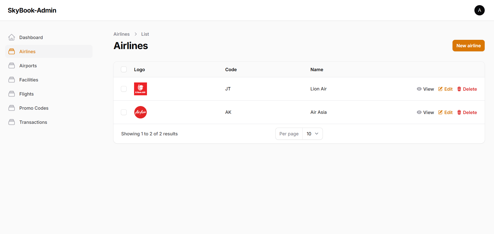
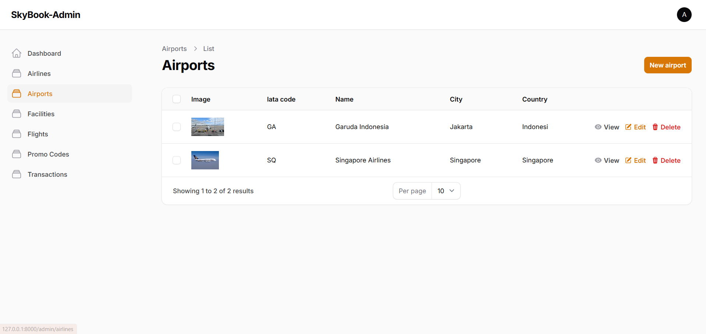
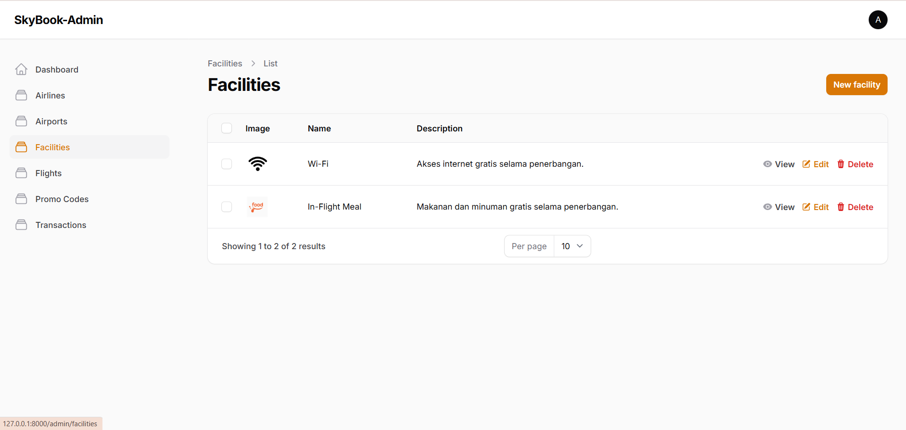
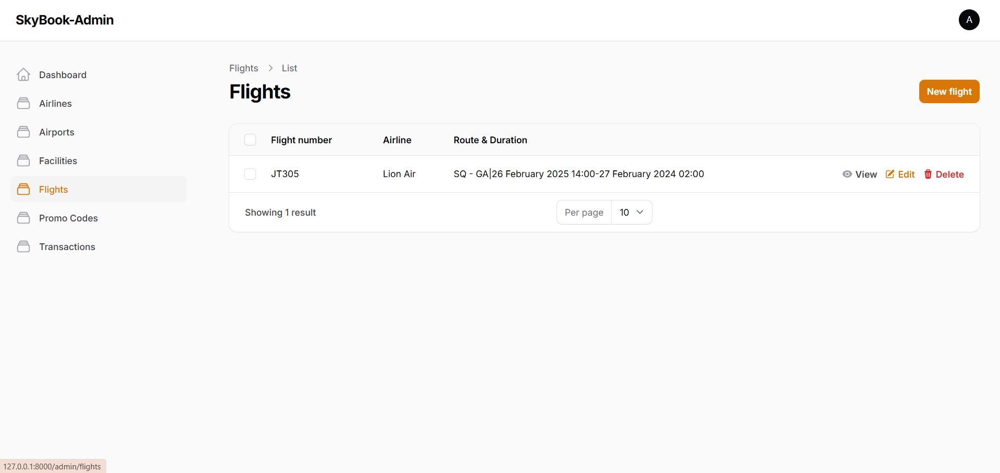
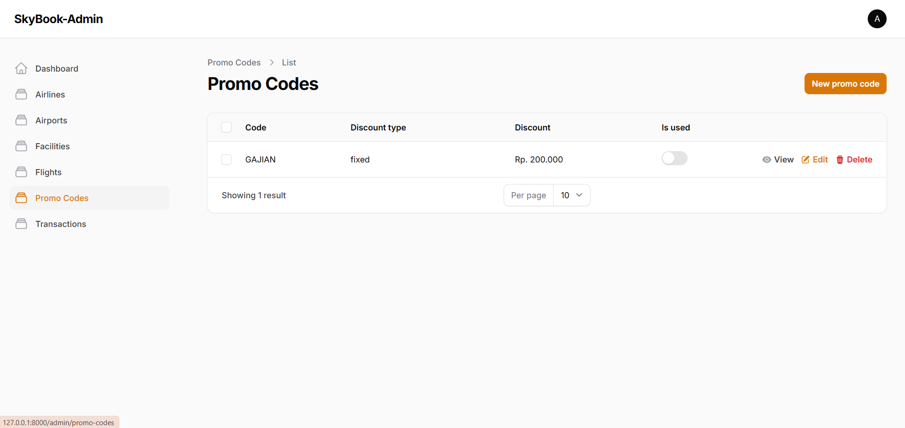

---

# ✈️ SkyBook Admin  

**SkyBook Admin** adalah Content Management System (CMS) untuk mengelola data pemesanan tiket pesawat dengan mudah dan efisien! Dibangun menggunakan **Laravel & Filament**, aplikasi ini dirancang untuk memberikan pengalaman admin yang cepat, aman, dan intuitif!   

## 🛠️ Teknologi yang Digunakan  
- 🖥 **Backend**: Laravel, Filament Admin  
- 🎨 **Frontend**: Blade, Tailwind CSS  
- 🗄 **Database**: MySQL  
- 🔐 **Autentikasi**: Laravel Sanctum  

## 📦 Instalasi & Menjalankan Proyek  

### 1️⃣ Clone Repository  
```bash
git clone https://github.com/Adik-soleh/skybook-App.git
cd skybook-App
```  

### 2️⃣ Install Dependencies  
```bash
composer install
npm install
```  

### 3️⃣ Konfigurasi Environment  
Buat file **`.env`** dan sesuaikan dengan konfigurasi database:  
```
APP_NAME=SkyBook Admin
APP_URL=http://localhost

DB_CONNECTION=mysql
DB_HOST=127.0.0.1
DB_PORT=3306
DB_DATABASE=skybook
DB_USERNAME=root
DB_PASSWORD=

FILAMENT_BRAND_NAME="SkyBook Admin"
```  

### 4️⃣ Setup Database  
```bash
php artisan migrate --seed
```  

### 5️⃣ Menjalankan Aplikasi  
```bash
php artisan serve
npm run dev
```  
Akses **SkyBook Admin** di `http://127.0.0.1:8000/admin` 🎉   

## 📸 **Screenshots**  

### 🏠 **Airlines Management**  
  

### 🛬 **Airport Management**  
  

### 🏢 **Facility Management**  
  

### ✈️ **Flight Management**  
  

### 🎟️ **Promo Code Management**  
  

## 🤝 Kontribusi  
Pull request selalu diterima! Pastikan untuk mendiskusikan perubahan besar terlebih dahulu melalui issue.  

## 📜 Lisensi  
Proyek ini menggunakan lisensi **MIT**.  

---
